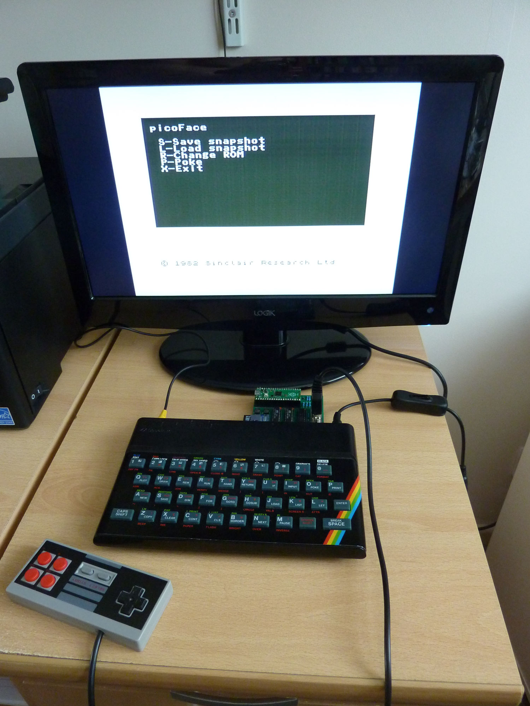
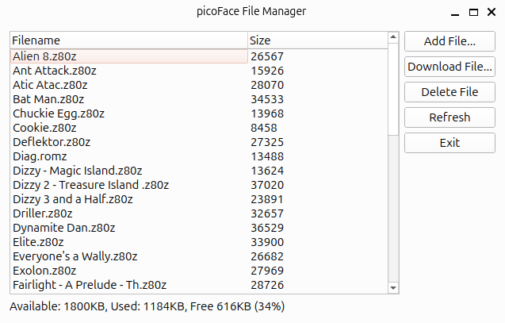

# picoFace

The picoFace is an inexpensive device for the ZX Spectrum that uses a Raspberry Pi Pico to provide Multiface style functionality.



It can be used to:
* Replace the internal ROM with another image, optionally making it writable.
* Load and save snapshots.
* Apply pokes to loaded games.
* Remotely control the Spectrum from another machine, like a PC or phone. This includes transferring snapshots and blocks of memory between theses devices.


For a demonstration of the device in action see this video:

[](https://www.youtube.com/watch?v=BUWlcWCz8AM)


## Related repositories

* The KiCad circuit design is held in https://github.com/brianapps/picoface_kicad
* The Android Studio project for the phone loading application is held in https://github.com/brianapps/picoface_phone


## Building the pico firmware

The firmware build relies on the following being installed and on the path:

- [sjasmplus](https://github.com/z00m128/sjasmplus)
- Python 3.x
- Raspberry Pi Pico SDK 
- VSCode and VSCode Pico plugin.

Building is performed by CMake, for example on Linux:

```
mkdir build
cd build
cmake -G Ninja -DCMAKE_BUILD_TYPE=Release ../pico
ninja
```

or on Windows:

```
md build
cd build
cmake -G Ninja -DCMAKE_BUILD_TYPE=Release ../pico
ninja
```

This will create the `picoface.uf2` that can be uploaded to the Pico e.g. using the `picotool`

```
picotool load picoface.uf2 -f
```

## GALasm

The [gal](./gal) folder holds the logic design for the PLDs used by picoface.

The logic is used to multiplex the address lines, perform memory access decoding, and io request decoding for the joystick.

- `GALV22V10.pld` The original logic for the proof of concept design. Two identical GAL22V10s are used and some redudant logic is duplicated.
- `GAL16v8_A.pld` and `GAL16v8_B.pld`. The revised design for the prototype PCB. The logic was reworked to fit onto smaller chips and redudant logic removed.

The `.pld` should be compiled with [GALasm](https://github.com/daveho/GALasm) as follows:

```
galasm <filename.pld>
```

and this produces `.chp`, `.fus`, `.jed` and `.pin` files.

I programmed the chips using a XGecu T48 programmer using the [minipro](https://gitlab.com/DavidGriffith/minipro) programmer.

To program the GAL22V10D use:

```
minipro -p GAL22V10D -w GAL22V10.jed -u
```

And to program the ATF16V8Bs use


```
minipro -p ATF16V8B -w GAL16v8A.jed -u
```

The `-u` flag makes the chip unprotected so you can double check things worked with

`minipro -p GAL22V10D --verify GAL22V10.jed`

There's also a python script [`updatesym.py`](gal/updatesym.py) that updates a custom KiCad part library so that the pin names in KiCad match those specified in the .pld file. This ensures parts placed in the schematic have the correct labels (by using the Pin Helpers -> Net Label command in KiCad) and that they also mapped to the correct pin numbers on the footprint. This eliminates transcribing errors and helps ensure the PCB is designed and routed correctly.

## Code

The picoFace firmware in the Pico and can be split into three main parts:
* The memory handler. This uses one core of the pico to emulate physical memory chips by bit banging. This core is given priority to the bus fabric to ensure the other core doesn't interrupt it. The timing is critical and incredibly tight, especially dealing with the extra progation delays of the multiplexer and the pico's input stabilisers. It uses a couple of the state machines in a single PIO devices and some optimised code to communicate with SM FIFOs. I struggled to get the C compiler to do what I wanted. I needed it to optimise certain code paths at the expense of others -- the compiler gave me the optimal choice across all code paths. In the end I learnt enough ARM M0 to hand craft the code in assembler.
* General purpose code. This uses the other core in the Pico to do all the other stuff. Timing is not that critical and its much easier to write. The general purpose code does things like polling the magic button, reading/writing from flash, SD card handling, responding to CLI requests, and handling interactions from the Spectrum.
* The NMI Rom. The code in the [nmirom](./nmirom) folder provides the picoFace menu handling. It is written in pure Z80 using the sjasmplus assembler. It provides a custom non-maskable interrupt handler at 0x66. The nmirom is automatically built by CMake via a custom command, the output from sjasmplus is converted (using the [asm_to_c_file.py](./pico/asm_to_c_file.py) script) to two files `nmi.c` which holds the binary and `nmi.h` that contains a selection of symbols.  The memory handler pages the NMI Rom in when the interrupt is executed and pages it out when the NMI Rom code exits. The NMI Rom communicates with the Pico by writing to certain memory locations. For example, to list the snap shots on the SD card we craft Z80 code to write a bunch parameters into memory e.g. what directory to list, the number of entries to read and where to store the results. The Z80 then spins waiting for the pico to respond. In turn the pico firmware monitors these memory address and acts upon these instructions, when complete it indicates so by modifying the content of the NMI ROM. The Z80 sees this change, exits its spin loop and continues. It's a crude remote procedure call scheme but it works.

The code bears all the signs of proof-of-concept/prototype work. Comprehensive error handling has been abandoned in favour of getting something working. Comments are not 100% up-to-date and redundant code is still present. They are signs of the blind alleys and dead ends followed in this kind of work.

## Scripts

Various Python scripts are included. Several use PySide6/QT and should be cross platform (they have been tested on Linux and Windows).

It is recommend to set up a virtual python environment and install the requirements given in `requirements.txt`. e.g.

on Windows
```
python -m venv env
env\bin\Activate
pip install -r requirements.txt
```

on Linux
```
python3 -m venv env
. env/bin/activate
pip install -r requirements.txt
```

The scripts include

* `usb.py`. This script handles the command line interface to the picoface. It uses the pySerial library to communicate with the RPi Pico via the USB port. 
* `convertZ80.py`. The picoFace only supports SNA and uncompressed version 1 Z80 snapshots. This script attempts to convert Z80 snapshots to this format. The picoFace can read files using LZ4 frame compression, and it turns out that the Z80 snapshot compression actually harms the LZ4 compression ratio. We are better off applying LZ4 to an uncompressed snapshot rather than a compressed snapshot (I think this is also true for Zip/Deflate).
* `drag_drop.py`. A simple PySide6/QT application that acts a drop target for Z80 files. Dropping a file from file explorer onto this window automatically uploads it to the picoFace.
* `create_snaps_zip.py`. A script to extract snapshots from a popular Spectrum archive and rezip them into a `snap.zip` files for use by other programs like the [phone loader](https://github.com/brianapps/picoface_phone). Putting all files in a single zip significantly speeds up copying files to another device, only one (big) file needs to be copied rather than 1000s of tiny files.
* `filemanager.py`. A PySide6/QT application to aid the management of snapshots and rom images held on the picoFace.

* `snap_uploader.py`. A bit like the phone loader but runs on the PC.


## License

picoFace is free software: you can redistribute it and/or modify it under the terms of
the GNU General Public License as published by the Free Software Foundation, either
version 3 of the License, or (at your option) any later version.

picoFace is distributed in the hope that it will be useful, but WITHOUT ANY WARRANTY; 
without even the implied warranty of MERCHANTABILITY or FITNESS FOR A PARTICULAR PURPOSE.
See the GNU General Public License for more details.

A copy of the license is provided in the [LICENSE](./LICENSE) file.


## Acknowledgments

The picoface firmware includes the following libraries:

* [pico-littlefs](https://github.com/lurk101/pico-littlefs) by lurk101
* [no-OS-FatFS-SD-SDIO-SPI-RPi-Pico](https://github.com/carlk3/no-OS-FatFS-SD-SDIO-SPI-RPi-Pico) by Carl J Kugler III
* [lz4](https://github.com/lz4/lz4) by Yann Collet.
* [Carton](https://damieng.com/typography/zx-origins/carton/) font by Damien Guard

